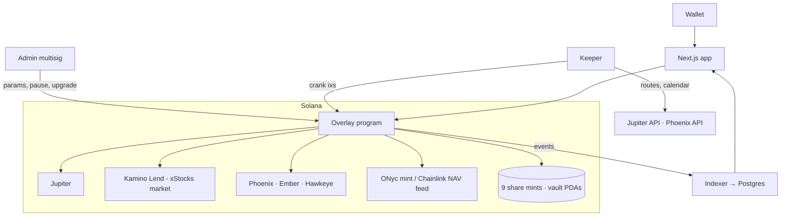
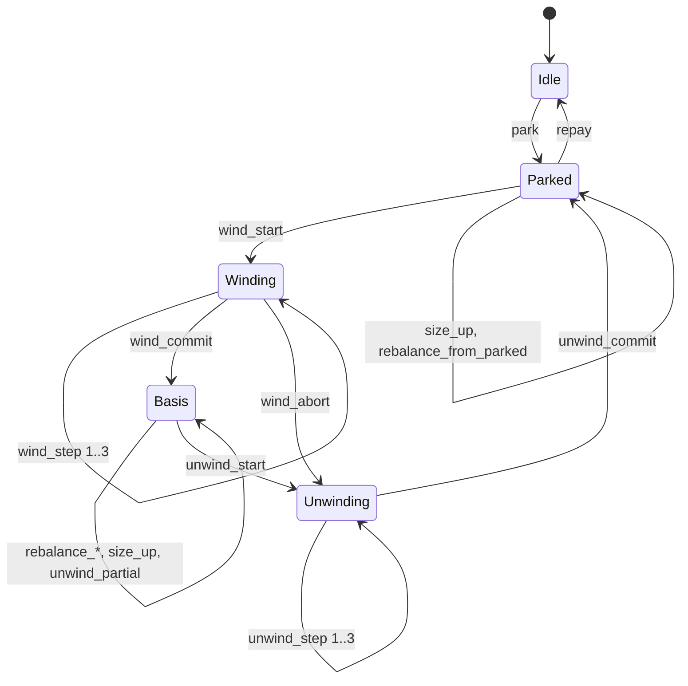

# Carrera Markets — xStock Funding Overlay Vaults

**Product one-pager + technical specification** · v0.4.1 · 24 Sep 2026 · Engineering handover

---

## Part A — Product one-pager

**What it is.** Nine vaults on Solana, one per equity that is listed on both Kamino's xStocks market and Phoenix perps: SPYx, QQQx, GOOGLx, TSLAx, NVDAx, MSTRx, CRCLx, HOODx, AAPLx. A user deposits the xStock they already want to hold and receives vault shares denominated in that stock. They keep 100% of the stock's price exposure. On top, the vault borrows USDC against the stock and puts that loan to work, paying what it earns back to depositors in USDC at redemption: stock back, plus USDC yield.

**Where the loan works.** The vault always holds a USDC loan against the deposited stock at the tier's LTV (20–30%). Every hour, each vault decides between two modes for that loan:

- **Basis mode** (funding is high): the loan buys the same xStock spot on Jupiter, posts it as extra Kamino collateral, borrows a little more, and shorts an equal notional on Phoenix. That leg is delta-neutral, so the vault's only price exposure is the depositor's stock. The short collects Phoenix funding in USDC.
- **Parked mode** (funding is not high enough): the loan buys **ONyc**, OnRe's reinsurance-backed yield token, and holds it. ONyc targets a blended 9–15% APY from reinsurance premiums plus stablecoin and treasury yield on its collateral. Kamino's plain USDC market (≈4.8%) is **not** used: it earns less than the loan costs.

The switch rule: a vault goes to Basis when the market's 24-hour rolling funding average, annualised, exceeds ONyc's trailing yield plus the extra cost of running Basis (secondary-loan interest and a round-trip trading cost amortised over an expected hold of about a month), by a margin; it returns to Parked when funding falls back below that hurdle by a margin. With today's inputs the hurdle is roughly 19% annualised funding, so Basis enters above about 21% and exits below about 18%. The two margins are the hysteresis that stops hourly flip-flopping.

**What the depositor earns**, on the stock's value, before trading costs and the performance fee:

| Mode | Formula | Example, 30% LTV vault |
|---|---|---|
| Basis | `L·f − L(1+L)·r` | TSLA funding 35%, borrow 5.9% → **≈ 8.2%** |
| Parked | `L·(y_onyc − r)` | ONyc 10%, borrow 5.9% → **≈ 1.2%** |

`L` = borrow LTV, `f` = Phoenix funding APY to shorts, `r` = Kamino USDC borrow APY, `y_onyc` = ONyc trailing yield.

**Custody and control.** All assets are held by program-owned accounts. The program itself executes every leg via CPI into Jupiter, Kamino and Phoenix, reads funding from Phoenix's Hawkeye view program, borrow rates from Kamino's reserves, and ONyc's NAV from its Chainlink oracle, so the Basis-or-Parked decision is enforced on-chain. The off-chain keeper only cranks transitions the program already permits and can never withdraw. Each vault has its own isolated Phoenix subaccount.

**Risks the design manages.** A stock drop raises the Kamino LTV; in Basis mode a stock rise stresses the Phoenix short. Each leg's stress is the other's relief (falling stock → short in profit → repay debt; rising stock → collateral worth more → top up margin), and a rebalancer runs every minute with emergency unwind as backstop. Buffers by tier are roughly −50% to −57% on the Kamino side and +16% to +26% on the Phoenix side before either would liquidate without intervention. In Parked mode the ONyc position carries reinsurance NAV risk and secondary-market liquidity risk, which is why the program bounds ONyc trades against its NAV oracle and caps position size to measured liquidity.

**Deposit, exit, redeem.** Deposit is one transaction. Exit places shares into an hourly epoch; the vault settles it from LTV headroom, ONyc sales, or a partial unwind, then flags the request ready. Redeem pays stock plus accrued USDC pro rata. Shares keep earning until the epoch settles.

**Fees.** 15% performance fee on the USDC yield only, never on stock appreciation, plus a 10 bp exit fee when an exit forces an unwind.

---

## Part B — Technical specification

### 1. Scope and definitions

| Term | Meaning |
|---|---|
| `V` | Value of depositor stock in the vault at oracle price `p` |
| `L` | Tier borrow LTV (§6.1) |
| `D` | Primary loan, `D = L·V`, always outstanding while the vault is not Idle |
| `D_b` | Secondary loan taken only in Basis mode, `D_b = L·D` |
| `f_avg` | 24-hour rolling average of the market's hourly Phoenix funding rate, annualised (×8760) |
| `y_onyc` | ONyc trailing yield: annualised growth of the ONyc NAV price over the last 30 daily samples |
| `r`, `s` | Kamino USDC borrow APY, supply APY (read from the reserve; `s` is informational only) |
| Basis | Loan deployed as spot-long / perp-short |
| Parked | Loan held as ONyc |
| Idle | No loan (only under guard, pause, emergency, wind-down) |

Venues: Jupiter (swaps), Kamino Lend xStocks market (stock collateral, USDC borrow), Phoenix perps + Ember (collateral wrapper) + Hawkeye (views), OnRe ONyc (via Jupiter swap or OnRe's mint/redeem program, see §10 Q1).

### 2. Allocation rule (per vault, evaluated on-chain)

```
cost_apy = roundtrip_cost_bps × 8760 / expected_hold_hours      // cost of one Basis round trip, annualised over the expected hold
hurdle   = y_onyc + L·r + cost_apy                              // all three in bps, annualised, on basis notional

to BASIS   : state == Parked  && f_avg > hurdle + enter_margin && market_open && samples >= W
to PARKED  : state == Basis   && f_avg < hurdle − exit_margin  && market_open
to IDLE    : state == Parked  && y_onyc < r + carry_guard_margin        (negative-carry guard)
to PARKED  : state == Idle    && y_onyc >= r + carry_guard_margin && !paused
```

Units: `f_avg`, `y_onyc`, `r`, `cost_apy` are all annualised rates on the basis notional `D`, so they add directly. `roundtrip_cost_bps` is the total cost of leaving Parked and coming back (ONyc sell, USDC→xStock, perp open, perp close, xStock→USDC, ONyc buy) as a fraction of `D`.

Defaults: `W = 24`, `enter_margin = 200 bps`, `exit_margin = 100 bps`, `carry_guard_margin = 50 bps`, `expected_hold_hours = 720` (30 days), `roundtrip_cost_bps = 60` (placeholder, measured in M6). With these, `cost_apy ≈ 730 bps`; at `y_onyc = 10%`, `L = 0.30`, `r = 5.9%` the hurdle is ≈ 19.1% and Basis enters above ≈ 21.1% annualised funding and exits below ≈ 18.1%.

Break-even check: Basis beats Parked only if `(f_avg − y_onyc − L·r) × hold ≥ roundtrip_cost`. At TSLA's 35% funding that is about 9–10 days of holding to recover a 60 bps round trip, which is why `expected_hold_hours` must be on the order of weeks, not a week, and why the hysteresis is not optional. M6 should set `expected_hold_hours` from measured funding persistence (how long funding stays above the hurdle once it crosses), not from a guess.

The `L·r` term is the interest on `D_b`, which only Basis pays. `y_onyc` and `r` are read in the same transaction as the decision; `f_avg` comes from the vault's own ring buffer (§7.1).

### 3. Architecture



Custody on-chain; sequencing off-chain through an explicit per-vault state machine; decisions on-chain from data the program reads itself.

### 4. Program structure

Anchor program `carrera_overlay`. CPI crates: `phoenix-rise` (`cpi` feature, Pinocchio contexts), `kamino-lending` CPI bindings, Jupiter v6 CPI (`shared_accounts_route`), SPL Token / Token-2022 for ONyc if applicable. Versioned transactions with address lookup tables (Phoenix orders alone need 12+ accounts).

#### 4.1 Accounts

| Account | Seeds | Fields / purpose |
|---|---|---|
| `Registry` | `["registry"]` | `admin`, `keeper[]`, `guardian`, `paused`, program whitelist (Jupiter, Kamino, Phoenix, Ember, Hawkeye, ONyc), ONyc mint + NAV feed, ONyc daily NAV ring buffer (30 × u64) |
| `OverlayVault` × 9 | `["vault", xstock_mint]` | `tier` params, `state`, `step`, `collateral_qty`, `basis_spot_qty`, `onyc_qty`, `debt_cached`, funding ring buffer (24 × i64) + `samples`, NAV cache (`nav_usd`, `slot`), `pending_exit_shares`, `epoch_id`, `deposit_cap`, `basis_cap`, `phoenix_subaccount_index`, bumps |
| `ShareMint` × 9 | `["shares", vault]` | Mint/freeze authority = vault PDA; decimals = xStock decimals |
| `KaminoObligation` × 9 | Kamino-derived for vault PDA | Depositor stock + basis spot as collateral; USDC debt |
| `OnycVault` × 9 | ATA of vault PDA for ONyc mint | Parked ONyc |
| `UsdcBuffer` × 9 | `["usdc", vault]` | Transit USDC; ≈ 0 at rest |
| `PhoenixTrader` + 9 isolated subaccounts | Phoenix-derived for `Registry` PDA | One subaccount per vault |
| `RedemptionVault` × 9 | `["redeem", vault]` | Stock ATA + USDC ATA for settled exits |
| `ExitRequest` | `["exit", vault, user, nonce]` | `shares`, `epoch_id`, `status` |
| `ExitEpoch` | `["epoch", vault, id]` | `shares_total`, `stock_owed`, `usdc_owed`, `stock_per_share`, `usdc_per_share`, `settled` |

#### 4.2 NAV and shares

```
depositor_qty     = collateral_qty − basis_spot_qty
NAV_usd           = collateral_qty·p − debt + phoenix_equity + onyc_qty·onyc_nav + usdc_buffer
share_price_stock = NAV_usd / (p · total_shares)          // 1.000 at genesis
```

`p` is the oracle Kamino uses for the xStock reserve; `onyc_nav` is the Chainlink NAV feed Kamino uses for ONyc; `phoenix_equity` from Hawkeye `view_margin` (collateral + unrealised PnL + pending funding). `refresh_nav` recomputes and caches with slot; `deposit` and `settle_epoch` require `slot − cache.slot ≤ max_nav_age_slots` (default 150).

**Redemption of `s` shares**, `φ = s / total_shares`:

```
stock_out = φ · depositor_qty
usdc_out  = φ · NAV_usd − stock_out · p
if usdc_out < 0: stock_out −= |usdc_out| / p; usdc_out = 0
```

### 5. Instructions

| Instruction | Signer | Pre-state | Post-state | Notes |
|---|---|---|---|---|
| `init_registry`, `set_params`, `set_roles`, `set_whitelist`, `pause`, `unpause` | admin / guardian | — | — | Guardian may only `pause` |
| `init_vault(xstock_mint, tier)` | admin | — | Idle | Creates share mint, Kamino obligation, Phoenix subaccount, ONyc ATA |
| `deposit(qty, min_shares)` | user | any except Unwinding | same | Refresh NAV; mint shares; Kamino deposit stock. Enforces `deposit_cap` |
| `deposit_usdc(usdc, min_shares)` | user | same | same | **Post-launch (v1.1).** Jupiter USDC→xStock with bound, then as `deposit`. Not in the launch frontend |
| `request_exit(shares)` | user | any | same | Escrow shares into open epoch |
| `cancel_exit` | user | epoch open | same | Return shares |
| `redeem(exit_request)` | user | epoch settled | same | Burn shares; pay stock + USDC; optional flag to swap USDC leg to stock |
| `record_funding` | anyone | any | same | ≤ 1/hour; Hawkeye `view_funding` → ring buffer |
| `record_onyc_nav` | anyone | — | — | ≤ 1/day; reads NAV feed → registry ring buffer |
| `refresh_nav` | anyone | any | same | Recompute NAV cache |
| `park` | keeper | Idle | Parked | Borrow `D`; buy ONyc (bounded, §7.3) |
| `wind_start` | keeper | Parked | Winding(0) | Rule check (§2) |
| `wind_step(n)` | keeper | Winding(n−1) | Winding(n) | §6.2 |
| `wind_commit` | keeper | Winding(3) | Basis | Hedge + LTV + margin checks |
| `wind_abort` | keeper | Winding(n) | Unwinding | Rolls back completed steps |
| `size_up` | keeper | Parked / Basis | same | Borrow increment after deposits; deploy per mode |
| `unwind_start(reason)` | keeper / guardian | Basis | Unwinding(0) | reason ∈ {rule, exit_demand, emergency}; rule requires §2 |
| `unwind_step(n)` / `unwind_commit` | keeper | Unwinding | Parked | Recovered USDC → ONyc |
| `unwind_partial(fraction, reason)` | keeper | Basis | Basis | For exits and de-risking |
| `rebalance_to_kamino`, `rebalance_to_phoenix` | keeper | Basis | Basis | §6.3 |
| `rebalance_from_parked(amount)` | keeper | Parked | Parked | Sell ONyc → repay debt when LTV high |
| `repay` | keeper / guardian | Parked | Idle | Guard, pause, emergency, wind-down only |
| `close_epoch`, `settle_epoch` | keeper | any | any | §8 |
| `crystallise_fee` | keeper | any | any | High-water mark on `share_price_stock` |

### 6. Strategy engine

#### 6.1 Risk tiers

| Tier | Vaults | Kamino liq LTV | `L` | Perp lev (1/L) | Drop to Kamino liq | Rise to Phoenix liq* | `min_margin` |
|---|---|---|---|---|---|---|---|
| A | SPYx, QQQx, GOOGLx | 70–75% | 30% | 3.3x | −57% (at 70%) | ≈ +26% | 12% |
| B | TSLAx, NVDAx | 65% | 30% | 3.3x | −54% | ≈ +26% | 12% |
| C | AAPLx | 50% | 25% | 4.0x | −50% | ≈ +21% | 10% |
| D | MSTRx, CRCLx, HOODx | 40% | 20% | 5.0x | −50% | ≈ +16% | 8% |

*Assumes ≈4% Phoenix maintenance margin; replace with each market's leverage-tier value (§10 Q2).

#### 6.2 State machine and steps



**Wind (Parked → Basis):**

| Step | Action | Program checks |
|---|---|---|
| 1 | Sell ONyc for `D` USDC (§7.3 bound) → Jupiter USDC→xStock → Kamino deposit as collateral | Route out-mint = xStock; `out ≥ D/p·(1 − max_swap_slippage_bps)`; `basis_spot_qty += out`; LTV ≤ `L` |
| 2 | Kamino borrow `D_b = L·D` → Ember wrap → Phoenix deposit to subaccount | LTV ≤ `L` after borrow |
| 3 | Phoenix market-order short, `base_lots = basis_spot_qty`, `last_valid_slot` set | Return data fill ≥ `(1 − max_perp_slippage_bps)·qty`; fill price within `max_index_dev_bps` of index |
| commit | Hawkeye `view_margin` | `|short − spot|/spot ≤ hedge_tol_bps` (50); margin ≥ `min_margin`; LTV ≤ `L` |

Step 1 may split into 1a (ONyc→USDC) and 1b (USDC→xStock→deposit) if compute requires. Each step verifies the vault's `step` counter and increments it.

**Unwind (Basis → Parked):** close short (reduce-only, bounded) → Phoenix withdraw → Ember unwrap → repay `D_b` → withdraw `basis_spot_qty` → Jupiter xStock→USDC (bounded) → buy ONyc with recovered USDC + realised funding (bounded). `unwind_partial(fraction)` runs the same on a fraction and stays in Basis.

**Park (Idle → Parked):** Kamino borrow `D` → buy ONyc. **Repay (Parked → Idle):** sell ONyc → repay `D`.

**size_up:** when `debt / collateral_value < L − size_band_bps` (default 300), borrow the increment; in Parked buy ONyc, in Basis run steps 1–3 on it. Keeper batches; never per deposit.

#### 6.3 Rebalancing

| Mode | Trigger | Action | Bound |
|---|---|---|---|
| Basis | LTV > `L + 800 bps` | `rebalance_to_kamino`: Phoenix withdraw free collateral → repay | Free collateral only; Phoenix margin stays ≥ `min_margin` |
| Basis | Phoenix margin < `min_margin + 500 bps` | `rebalance_to_phoenix`: Kamino borrow → Phoenix deposit | LTV stays ≤ `L` |
| Parked | LTV > `L + 800 bps` | `rebalance_from_parked`: sell ONyc → repay | Sale bounded by §7.3; may not sell below `min_onyc_price` outside emergency |
| Any | LTV > `emergency_ltv` or margin < `emergency_margin` | `unwind_start(emergency)` / `repay` | Skips the rule, keeps slippage bounds |

Optional `margin_reserve_bps` keeps extra borrowed USDC in the Phoenix subaccount for Tier D.

### 7. Oracles, data and bounds

#### 7.1 Funding history
`record_funding` CPIs Hawkeye `view_funding`, decodes return data, pushes the hourly rate into the vault ring buffer; `samples` saturates at 24. `f_avg = mean(buffer) × 8760`.

#### 7.2 ONyc yield
`record_onyc_nav` reads the Chainlink NAV feed once per day into the registry ring buffer (30 × price). `y_onyc = (nav_now / nav_30d_ago − 1) × (365/30)`. Fewer than 8 samples → use `parked_apy_override` (admin-set, default 900 bps) with a `stale` flag in events. Admin may also cap `y_onyc` used in the rule at `max_parked_apy_bps` to avoid chasing an incentive-inflated print.

#### 7.3 ONyc trading bounds
Every ONyc buy or sell passes `min_out` derived from the NAV feed: buy only if effective price ≤ `nav × (1 + max_onyc_premium_bps)` (default 30); sell only if ≥ `nav × (1 − max_onyc_discount_bps)` (default 50). Emergency actions may widen the discount to `emergency_onyc_discount_bps` (default 300). If OnRe's own mint/redeem program is CPI-callable at NAV, prefer it for primary flows and use Jupiter only for the secondary (§10 Q1). Per-vault `onyc_cap` limits parked size to measured liquidity.

#### 7.4 Stock and perp bounds
Jupiter routes: out-mint check, `min_out` from Kamino's oracle × slippage bound, route accounts must belong to the whitelisted Jupiter program. Phoenix fills: return-data fill check, index deviation check, `last_valid_slot`.

#### 7.5 Market hours
`wind`, `unwind`, `size_up`, `park`, exit-driven partials: only while the Phoenix calendar marks the underlying open (program checks the on-chain market status flag). `rebalance_*`, `rebalance_from_parked`, emergency actions, `repay`: any time.

### 8. Exit processing

```mermaid
sequenceDiagram
  participant U as User
  participant P as Program
  participant K as Keeper
  U->>P: request_exit(shares) → epoch N (open)
  K->>P: close_epoch(N): snapshot stock_owed, usdc_owed at current NAV
  alt LTV headroom covers stock_owed and usdc_owed available
    K->>P: settle_epoch(N): Kamino withdraw stock; USDC from ONyc sale (Parked) or Phoenix free collateral (Basis)
  else must de-lever first
    K->>P: rebalance_from_parked / unwind_partial until debt/(collateral − stock_owed) ≤ L
    K->>P: settle_epoch(N)
  end
  U->>P: redeem → stock + USDC
```

`settle_epoch` cannot move more than the snapshot and cannot mark an under-funded epoch settled. Epoch cadence: hourly by default (`epoch_len_secs`).

### 9. Fees, roles, invariants, events

**Fees:** performance fee `perf_fee_bps` (1500) on growth of `share_price_stock` above high-water mark, crystallised as shares to treasury at `close_epoch`; exit fee `exit_fee_bps` (10) retained in NAV when settlement required an unwind or ONyc sale beyond free headroom; no deposit or management fee.

**Roles:** `admin` (Squads multisig + timelock): params, tiers, caps, whitelist, keeper set, upgrades. `keeper` (rotatable hot keys): all crank instructions. `guardian`: `pause`, `unwind_start(emergency)`, `repay`. Anyone: `record_*`, `refresh_nav`.

**Invariants:**
1. Shares minted only in `deposit*`, burned only in `redeem`, both at cached NAV within staleness bound.
2. Assets leave vault PDAs only toward whitelisted programs' accounts or `RedemptionVault`.
3. `depositor_qty` changes only via `deposit*` and `settle_epoch`.
4. After `wind_commit`, `size_up`, every `rebalance_*`: hedge within tolerance, LTV ≤ `L`, margin ≥ `min_margin`.
5. At rest, borrowed USDC is either ONyc (Parked) or the basis trade (Basis); never plain USDC beyond `UsdcBuffer` dust.
6. Mode transitions by rule occur only when §2 holds in the same transaction; `repay` only under guard, pause, emergency or wind-down.
7. Every ONyc trade satisfies §7.3; every stock/perp trade satisfies §7.4.
8. `settle_epoch` never exceeds the snapshot liability.

**Events:** `Deposited`, `ExitRequested`, `ExitCancelled`, `EpochClosed`, `EpochSettled`, `Redeemed{stock, usdc}`, `StateChanged{vault, from, to, step}`, `Parked{usdc, onyc}`, `Wound`, `SizedUp`, `Unwound`, `Repaid`, `Rebalanced{kind, amount}`, `FundingRecorded`, `OnycNavRecorded`, `RuleEvaluated{f_avg, y_onyc, r, hurdle, decision}`, `NavRefreshed{nav_usd, share_price_stock}`, `FeeCrystallised`, `Paused`.

### 10. Verification items and open questions

1. **ONyc acquisition path.** Whether OnRe exposes a CPI-callable mint/redeem at NAV, its settlement time, and any KYC or allow-list on the minter; otherwise Jupiter secondary depth at $50k / $250k / $1M and typical premium/discount to NAV.
2. **Phoenix maintenance margin** per equity market (leverage tiers) → finalise `L` and `min_margin` for Tiers C/D.
3. **Kamino xStocks reserve caps** for deposits and USDC borrows; depositor stock and basis spot share a reserve.
4. **ONyc NAV feed** address, update cadence, and behaviour during OnRe's attestation windows; whether Kamino's ONyc reserve pays a supply APY worth capturing (would add a Kamino supply step to Parked).
5. **Jupiter xStock depth** in and out of US hours → `deposit_cap`, `basis_cap`, `size_up` batch size.
6. **Round-trip cost** measured on mainnet → `roundtrip_cost_bps`.
7. **ONyc yield persistence**: how much of the current yield is incentive-driven; sets `max_parked_apy_bps`.
8. **Epoch cadence** hourly vs daily; whether to pay yield continuously (claimable USDC) instead of at redemption.
9. **Regulatory and tax characterisation** of borrowing against and hedging around deposited tokenised stock, and of holding a reinsurance-backed token in the vault: counsel, jurisdiction-dependent; UI makes no claims.

### 11. Parameter defaults

| Param | Default | Notes |
|---|---|---|
| `W` | 24 | funding samples |
| `enter_margin_bps` / `exit_margin_bps` | 200 / 100 | hysteresis around hurdle |
| `carry_guard_margin_bps` | 50 | `y_onyc` must exceed `r` by this |
| `expected_hold_hours` | 720 | cost amortisation; set from measured funding persistence in M6 |
| `roundtrip_cost_bps` | 60 (placeholder) | measured in M6 |
| `parked_apy_override_bps` / `max_parked_apy_bps` | 900 / 1500 | fallback and cap for `y_onyc` |
| `max_swap_slippage_bps` / `max_perp_slippage_bps` / `max_index_dev_bps` | 50 / 30 / 50 | |
| `max_onyc_premium_bps` / `max_onyc_discount_bps` / `emergency_onyc_discount_bps` | 30 / 50 / 300 | |
| `hedge_tol_bps` | 50 | |
| `size_band_bps` | 300 | |
| `rebalance_ltv_band_bps` / `rebalance_margin_band_bps` | 800 / 500 | |
| `emergency_ltv` | liq LTV − 500 bps | per tier |
| `max_nav_age_slots` | 150 | |
| `epoch_len_secs` | 3600 | |
| `perf_fee_bps` / `exit_fee_bps` | 1500 / 10 | |
| Caps | $25k per vault at canary | raised by admin |

### 12. Keeper

Rust service using `phoenix-rise` off-chain features, Kamino SDK, Jupiter quote API, OnRe SDK if any. Hourly: `record_funding` ×9 → `record_onyc_nav` (daily) → evaluate §2 → move loans between Parked and Basis while markets open → `size_up` → `close_epoch` / `settle_epoch` → `crystallise_fee` → `refresh_nav`. Every 60 s: read LTV and Hawkeye margin per vault; fire `rebalance_*` or emergency. Two instances with leader lease; state machine makes duplicate sends harmless. Alerts: stuck intermediate state > 15 min, health within 300 bps of emergency, NAV stale, ONyc trade bound rejections, keeper SOL. Holds no funds beyond fee SOL.

### 13. Web app

**Stack:** Next.js (App Router, TypeScript), Tailwind + Carrera tokens, `@solana/kit` + Codama client, Wallet Standard adapter, TanStack Query, WebSocket subscriptions on the nine `OverlayVault` accounts, Supabase indexer via Helius webhooks.

| Route | Contents |
|---|---|
| `/` | Nine vault cards: stock price, TVL / cap, trailing yield (7d / 30d, USDC on stock value), mode badge (Basis on Phoenix / Parked in ONyc), funding vs hurdle sparkline |
| `/vault/[symbol]` | "Hold TSLAx, earn USDC." Share price in stock, yield history, mode and where the loan is, LTV and Phoenix margin gauges, funding chart against the ONyc-based hurdle with enter/exit bands, ONyc NAV and position, market open/closed, deposit / exit / redeem panel |
| `/portfolio` | Per vault: shares, stock value, accrued USDC, exit requests and status |
| `/activity` | Winds, unwinds, parks, rebalances, epochs, fees, tx links |
| `/docs` | Mechanism, risks (liquidation, venue, oracle, ONyc NAV and liquidity, off-hours), fees, parameters |
| `/admin` | Gated: params, pause, keeper health, manual step recovery |

**Panel:** Deposit (xStock only at launch; USDC buy-on-deposit is v1.1) → shares preview → one tx. Exit → settlement estimate ("from headroom at next epoch close" / "requires trimming; typically within one US session") → `request_exit`, cancellable while open. Redeem → claimable stock + USDC, optional "receive yield as stock".

**Numbers:** yield = trailing realised growth of `share_price_stock` in USDC terms (7d, 30d, since inception), never a forward projection; no "you'd earn" figures in the deposit form. A vault younger than 7 days shows "since inception" only. The current mode and live hurdle may be displayed as facts, not as an APY. Health gauges from Kamino and Hawkeye simulations. Redemption preview must handle the early-life case where the USDC leg is zero and the stock leg is slightly reduced (§4.2), with a one-line explanation.

### 14. Testing and milestones

LiteSVM with `phoenix-rise-litesvm-test` fixtures plus Kamino, Jupiter and ONyc program dumps: every step, abort, rebalance, park/repay and exit path per tier. Property tests over random price paths and ONyc NAV paths: invariants §9; no liquidation while rebalance triggers fire within tier buffers; redemption pro rata exactness. Mainnet-fork replay of real funding and ONyc NAV history to set `W`, margins and cost. Canary at $25k per vault. Two audits; multisig timelock; verified build.

| # | Milestone |
|---|---|
| M1 | Vault core: stock deposit, NAV, exit epochs, stock + USDC redemption, Kamino collateral, `park` / `repay` with ONyc |
| M2 | Basis state machine with Jupiter + Kamino + Phoenix CPIs for TSLAx; LiteSVM suite |
| M3 | Funding and ONyc NAV buffers, on-chain rule, rebalancer (both modes), `size_up`, all nine tiers |
| M4 | Keeper with leader lease and alerting; canary |
| M5 | Web app and indexer |
| M6 | Audits, measured parameters, public launch with caps |
